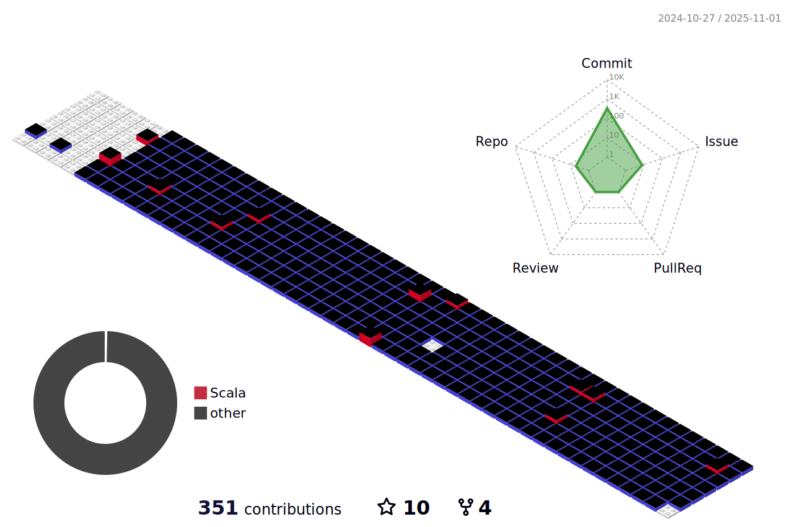

<picture>
  <source media="(prefers-color-scheme: dark)" srcset="https://raw.githubusercontent.com/qidian99/qidian99/output/github-contribution-grid-snake-dark.svg">
  <source media="(prefers-color-scheme: light)" srcset="https://raw.githubusercontent.com/qidian99/qidian99/output/github-contribution-grid-snake.svg">
  
</picture>
<!--   my-header-img -->

                                                                                                                                                                           

 

<!--   profile-green-animate -->

<!--   grid-snake -->
<!--  -->

  <!-- skyline 
 -->

<!--  2d history skills -->
</img>

### Profile Views
counting of visitors to this page in this section started from June 12, 2022

 
